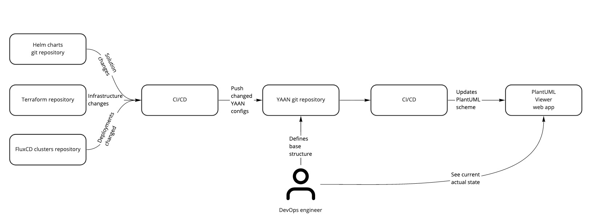

# YAAN (Yet Another Architecture Notation)

This project was created so that you can describe all the components of your software, as well as your infrastructure in which it is deployed in a simple declarative form, using YAML or another supported standard format.

YAAN notation can be exported to any representation formats like PlantUML or Structiruzr DSL.
Also you can create YAAN from your IaC config files like Terraform, continuous delivery configs and, for example, helm charts / docker-compose files combining them into one schema that can be exported to PlantUML. And you will have an up-to-date visual diagram of the deployments of your entire project.

YAAN uses few base entity types:
* Solution - describes components (usualy docker-containers) of your solution
* Server - your server with hardware details
* Provider - any provider, hosts your infrascturcture
* KubernetesCluster - describes your cluster
* Deployment - defines which components on which infrastracture is deployed at the moment
* Presentation - combines all entities into one view scope. For example, you can have presentation for only your development environment, or prouction or worldwide presentation of all your clusters / servers / solution. Presentations is the ones exported to any visual representation formats.

## CI/CD

One of the main goals for which YAAN was created is the ability to minimize manual labor for all changes in your applications or infrastructure. Therefore, YAAN is focused on the fact that the notation will be changed automatically when the application code, the code describing the infrastructure, is changed.

Example workflow:

## YAAN notation documentation

Detailed description of entities you can read in [schema-docs](./schema-docs) directory.

## CLI

This module provides CLI for exporting and validating YAAN projects. Type yaan --help for details.
